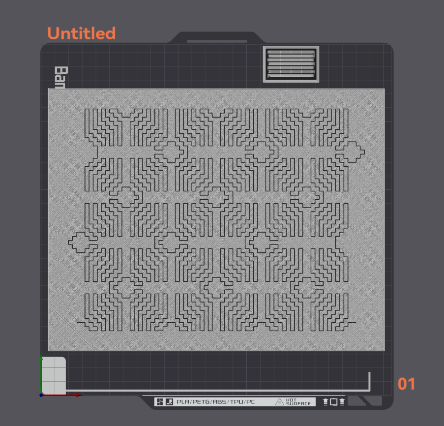

# Wacław Szpakowski Gcode Generator
Wacław Szpakowski (1883–1973) was a Polish architect and artist renowned for his work in abstract line art. His drawings, created using a single continuous line, explored geometric forms and patterns. I wanted to realise some of his works via 3D printing. The concept of single line art translates well to 3D printing in the form of a single continuous extrusion.

An example of Szpakowski's work. B9 1926.

3D printed version of B9.

The code in this repository takes in a list of points and generates gcode which can be printed on a 3D printer.

## How To Make Your Own
Note: This does require some level of knowledge of gcode and 3D printing. There is potential to damage your 3D printer if you mess something up. Do so at your own risk.
- You will first need a list of points that describe the work. This should be a CSV, one line per point with just the X and Y coordinate, seperated by a comma. You can write your own, or do what I did and use one of the many examples on [TurtleStitch](https://turtlestitch.org/) by user [Elaine](https://turtlestitch.org/users/Elaine). [Searching "Szpakowski" on TurtleStitch](https://turtlestitch.org/search/projects/?q=Szpakowski) will give many options (B9 is included in this repository). Once you find a design, click on any of the orange or blue cells to generate the pattern, then export to SVG. Open the SVG in a text editor and convert all the points into CSV format.
- Make a model of the base you want to print on. I used a simple rectangle, 0.9 mm (3 layers at 0.3 mm layer height) thick. Model a short rectangle on top that is the width of the line for the art and the length of the grid size. The width should be 1/4 the grid size. This will be used to calculate the `e_per_grid` parameter.
- Slice the model in your slicer of choice. Put a colour change between the base and the line on top. Export gcode.
- Have a look at the gcode and work out how much filament to extrude for each line of the artwork. You can tell by looking at what is extruded for the line on the top.
- Open `points_to_gcode.py` and adjust the filenames and parameters at the top of the file to suit your requirements. Then run the script. You should have some gcode.
- Copy the gcode and open paste it over the top of the gcode for the line on top of the base.
- View the gcode in a gcode viewer (your slicer probably does this). Check that everything looks good. Look out for any weird travel moves that you may need to edit manually.
- Print.

Visualisation of the gcode in Orca Slicer.

## Tips/Notes
- I used a Hilbert Curve top fill pattern for the base. This gives it a little texture and, to my eye, looks better than the normal diagional lines. Although it is significantly slower.
- Gcode editors (at least Orca Slicer) do not correctly show the width of lines. So if your lines look too thick or thick, don't worry too much. You can always do a small test print so see if things are to your liking.

## Files In This Repository
- `b9_base.3mf`: A sliced version of the base for the B9 artwork. It is setup for a Bambu Lab P1 printer.
- `b9_base.stl`: A model of the base with a 10 mm long line on top. The base is 246 x 192 x 0.9 mm.
- `b9_full_PLA.gcode`: Gcode that will print the artwork pictured. It is for a Bambu Lab P1 printer with an AMS and a 0.6 mm nozzle installed. If this does not match your setup, you will need to generate your own gcode.
- `b9_line.gcode`: The gcode for the B9 artwork with a grid size of 3 mm.
- `b9_points.txt`: A list of points for the B9 artwork. The grid size is 12 mm.
- `points_to_gcode.py`: Script that takes in a list of points and writes out gcode.
- `Waclaw_Szpakowski_B9_1926.svg`: SVG of the B9 artwork (from [TurtleStitch](https://turtlestitch.org/)).

Another example of Szpakowski's work. A1.